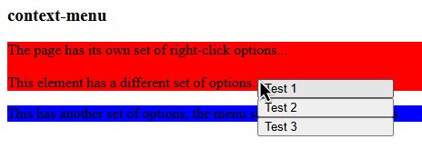

# Context Menu `context-menu`

The `context-menu` element creates a custom right-click menu for a specified element or the document body.



## Installation

To install `context-menu`, include the component source file in your web app using a `<script>` element:

```html
<script src="path/to/context-menu.js"></script>
```

Once loaded, you can use `<context-menu>` anywhere in your project.

## Usage

Add a `context-menu` element inside the element you want to attach the menu to:

```html
<div>
  Right-click me!

  <context-menu>
    <button>Option 1</button>
    <button>Option 2</button>
  </context-menu>
</div>
```

When the user right-clicks the target element, the context menu will appear at the mouse position.

By default, the menu targets its parent element. If the parent is `<body>`, the menu will listen for context-menu events on the entire window.

## Attributes

### `target-id`

The optional `target-id` attribute specifies the `id` of the element that the context menu should be attached to.

Using the `target` attribute is an alias for `target-id`.

```html
<div id="my-element">Right-click me!</div>

<context-menu target-id="my-element">
  <button>Option 1</button>
</context-menu>
```

If the specified element cannot be found, the component will throw an error.

### `multiple`

The `multiple` attribute controls whether the menu remains open after an option is selected.

By default, selecting an option closes the menu.

```html
<context-menu multiple>
  <button>Option 1</button>
  <button>Option 2</button>
</context-menu>
```

When `multiple` is present, the menu remains open after selecting an option.
It only closes when the menu is unfocused.

## Menu Options

Any elements inside the `context-menu` can act as menu options.

Buttons are recommended:

```html
<context-menu>
  <button>Copy</button>
  <button>Paste</button>
  <button>Delete</button>
</context-menu>
```

When an option is clicked, the menu dispatches a `select` event.

The selected element is available through the event's `detail.selection` property.

```js
contextMenu.addEventListener("select", (event) => {
  const selection = event.detail.selection;

  console.log(selection);
});
```

## Nested Context Menus

Context menus can be nested to provide different menus for different elements.

```html
<div>
  <context-menu>
    <button>Parent option</button>
  </context-menu>

  <div>
    <context-menu>
      <button>Child option</button>
    </context-menu>
  </div>
</div>
```

When multiple context menus could handle the same right-click, the closest applicable menu is used.

Only one context menu can be active at a time. Opening another menu automatically closes the currently active menu.

## Events

### `select`

Dispatched when a menu option is selected.

The selected element is provided through `event.detail.selection`.

```js
contextMenu.addEventListener("select", (event) => {
  console.log("Selected:", event.detail.selection);
});
```

## Custom CSS

`context-menu` comes with a small set of default styles.

By default:

- The menu is hidden until it is active.
- The menu is positioned absolutely.
- The menu has a minimum width of `150px`.
- Direct and nested menu elements are displayed as full-width blocks.
- Menu options are left-aligned.

### CSS Variables

The minimum menu width can be customized using the `--context-menu-min-width` CSS variable:

```css
body {
  --context-menu-min-width: 200px;
}
```
