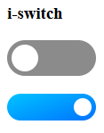

# Switch `i-switch`

The `i-switch` element is a custom toggle switch that behaves like a checkbox with a more polished UI.



## Installation

To install `i-switch`, include the component source file in your web app using a `<script>` element:

```html
<script src="path/to/i-switch.js"></script>
```

Once loaded, you can use `<i-switch>` anywhere in your project.

## Usage

Add an `i-switch` element to your HTML:

```html
<i-switch></i-switch>
```

That's it! The switch is off by default.

## Attributes

### `value`

Use the `value` attribute to set the initial state of the switch.

```html
<i-switch value="true"></i-switch>
```

The following values are supported:

- `true` or `1` - turns the switch **on**.
- Any other value - turns the switch **off**.

## Methods

### `getValue()`

Returns the current value of the switch.

```js
const value = switchElement.getValue();
```

## Events

The switch dispatches an `input` event whenever its value changes.

```js
switchElement.addEventListener("input", (e) => {
  console.log(e.target.value);
  console.log(e.target.getValue());
});
```

## Custom CSS

`i-switch` comes with preset styles that you can customize to match your application.

Additionally, the component exposes the following CSS custom properties in the document body:

| Variable           | Description                             |
| ------------------ | --------------------------------------- |
| `--i-switch-outer` | Sets the color of the switch container. |
| `--i-switch-knob`  | Sets the color of the switch knob.      |

For example:

```css
body {
  --i-switch-outer: #333;
  --i-switch-knob: #fff;
}
```
