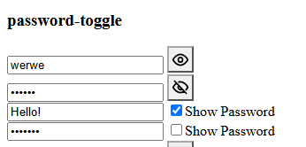

# Password Toggler `password-toggle`

The `password-toggle` element is a button that toggles the visibility of a nearby password input.



## Installation

To install `password-toggle`, include the component source file in your web app using a `<script>` element:

```html
<script src="path/to/password-toggle.js"></script>
```

Once loaded, you can use `<password-toggle>` anywhere in your project.

## Usage

Add a `password-toggle` element to your HTML:

```html
<password-toggle></password-toggle>
```

By default, the component looks for a password input in a nearby sibling or parent element. If no suitable input is found, it will throw an error.

## Attributes

### `target-id`

The `target-id` attribute specifies the `id` of the input element that the toggle should control.

If no input with the specified `id` is found, the component will throw an error.

```html
<password-toggle target-id="my-input"></password-toggle>
<input type="password" id="my-input" />
```

### `layout`

The `layout` attribute specifies which type of toggle UI to display.

Supported values are:

- `button` - displays a button. This is the default.
- `checkbox` - displays a checkbox with a "show password" label.

```html
<password-toggle layout="checkbox"></password-toggle>
```

## Methods

### `setViewable(viewable, opt_viewableType)`

Sets whether the target password input is visible.

The `viewable` argument is a boolean that determines whether the password should be shown.

The optional `opt_viewableType` argument specifies the input type to use when the password is visible. If omitted, the component uses its default visible input type.

```js
// Show the password as a color input
const value = passToggler.setViewable(true, "color");
```

### `toggleViewable()`

Toggles the visibility of the target input.

```js
const value = passToggler.toggleViewable();
```

## Events

`password-toggle` does not dispatch any custom events.

## Custom CSS

`password-toggle` comes with preset styles that you can customize to match your application.

## Extra

When using the `button` layout, you can customize the images displayed by the toggle button through the `PasswordToggle` class:

```js
PasswordToggle.IMG_SHOW = "...new image url";
PasswordToggle.IMG_HIDE = "...new image url";
```
